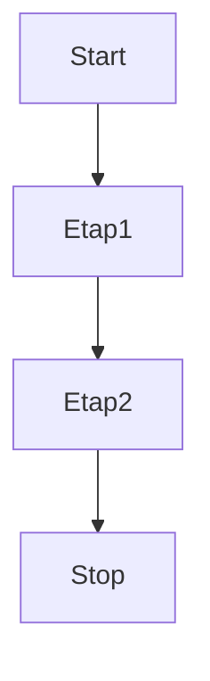

# src# Nagłówek bardzo duży
od nowej linijki **pogrubiamy**, tylko tam gdzie użyjemy "*"

## Nagłówek średni
Jakiś tekst pod spodem *kursywa też jest dostępna* 

### Nagłówek najmniejszy
- pierwszy element
- drugi element
- trzeci element
  - podpunkt
  - kolejny podpunkt
- ostatni element

`kod źródłowy` 

```
Blok
kodu
Blok
kodu
```

[Tekst do wyświetlenia](http://google.pl)


| nazwa kolumny A | nazwa kolumny B | nazwa kolumny C|
| --- | --- | --- |
| Zawartość A | Zawartość B | Zawartość C |
| Wartość A | Wartość B | Wartość C |




```
title: node
  flowchart LR
```